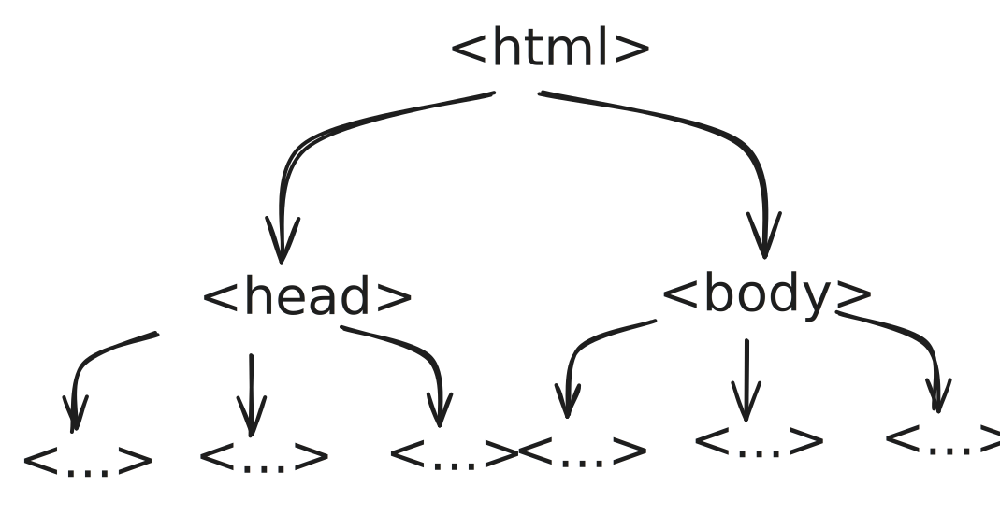

import { FileTree } from "@astrojs/starlight/components";

Bien, llevamos un par de paginas hablando de HTML, pero no hemos profundizado en lo que es HTML, y lo que hace. Como bien definimos en la introducción a la web, HTML es el lenguaje de marcado que se utiliza para estructurar el contenido de una página web. HTML es el esqueleto de la web, y define la estructura y el contenido de una página.

## ¿Qué es un lenguaje de marcado?

Un lenguaje de marcado es un sistema de codificación que se utiliza para estructurar y organizar el contenido de un documento. Un lenguaje de marcado utiliza etiquetas para definir la estructura y el significado del contenido.

## ¿Qué es una etiqueta?

Las etiquetas son los elementos básicos de un lenguaje de marcado, y se utilizan para definir la estructura y el significado del contenido. Las etiquetas se escriben entre corchetes angulares `< >`, y suelen tener una etiqueta de apertura y una etiqueta de cierre, aunque algunas etiquetas pueden ser auto-cerradas.


Las etiquetas pueden contener texto, otras etiquetas, ambos, o nada, y se utilizan para definir la estructura y el significado del contenido de una página web. Por ejemplo, la etiqueta `<h1>` se utiliza para definir un título de nivel 1, y la etiqueta `<p>` se utiliza para definir un párrafo de texto, tambien tenemos etiquetas como `` que se utilizan para insertar imágenes, y que son auto-cerradas, lo que significa que no tienen una etiqueta de cierre, sino que se cierran a sí mismas y se escriben con una barra al final de la etiqueta de apertura, como `` y otras tienen propiedades que se pasan con un formato de clave-valor dentro de la propia etiqueta, ej: `<etiqueta propiedad="valor" />` igualmente todo esto lo veremos con más detalle proximamente.


## Html tiene una estructura jerárquica

HTML tiene una estructura jerárquica, lo que significa que las etiquetas pueden contener otras etiquetas, creando una estructura de árbol. La etiqueta raíz de un documento HTML es `<html>`, que contiene dos etiquetas principales: `<head>` y `<body>`.



### Hagamos un pequeño experimento:

vamos a escribir un documento HTML básico, y vamos a probarlo en el navegador. Para ello, vamos a crear una carpeta llamada practica-web, y vamos a abrir esa carpeta en nuestro editor de codigo (Visual Studio Code). Dentro de esa carpeta, vamos a crear un archivo llamado index.html, en esta carpeta vamos a tener nuestro documento HTML que vamos a estar editando a lo largo de esta unidad, y que vamos a ir viendo como va evolucionando a medida que vamos aprendiendo HTML.

<FileTree>
  - practica-web - Carpeta raíz de nuestro proyecto web 
    - index.html - El esqueleto de nuestra página web
</FileTree>

Dentro de este archivo index.html, vamos a escribir el siguiente código:

:::tip[¿Sabías esto?]
Lo que encontramos aquí abajo es un bloque de codigo, a lo largo de esta documentación vamos a encontrar muchos bloques de código, y es importante que sepas que estos bloques de código no son solo texto, estan divididos en dos partes, la superior es la previsualización del resultado del código, y la inferior es el código en sí.
:::

```html preview
<html>
  <body>
    <h1>Hola, mundo!</h1>
  </body>
</html>
```

Una vez que tenemos este código escrito, vamos a abrir el archivo index.html en nuestro navegador entrnado en la carpeta practica-web y haciendo doble clic en el archivo, y vamos a ver el resultado. Deberíamos ver un título que dice "Hola, mundo!", esto es porque hemos utilizado la etiqueta `<h1>` para definir un título de nivel 1, y hemos escrito el texto "Hola, mundo!" dentro de esa etiqueta, ahora indagaremos en mayor profundidad, esto solo es un pequeño experimento para ver como funciona HTML, y como se estructura el contenido de una página web utilizando etiquetas.

## ¿Head y Body, qué son?

Es una pregunta común cuando se empieza a aprender HTML, ¿qué es el head y el body?, ¿Són necesarias?, ¿Qué va en cada uno de ellos?

### Head
El head es la parte del documento HTML que contiene información sobre el documento, como el título de la página, los metadatos, los enlaces a los archivos de estilos, y otros recursos que no se muestran directamente en la página web, pero que son importantes para el funcionamiento y la apariencia de la página.

Digamos que el head es donde se encuentra la información que el navegador necesita para entender cómo mostrar la página, pero que no es parte del contenido visible de la página.

Etiquetas comunes que se encuentran en el head son `<title>`, `<meta>`, `<link>`, y `<script>`.

### Body
El body es la parte del documento HTML que contiene el contenido visible de la página web, es donde se encuentra el texto, las imágenes, los videos, y otros elementos que forman la página web que los usuarios ven e interactúan con ellos. El body es la parte más importante de un documento HTML, ya que es donde se encuentra el contenido que queremos mostrar a los usuarios.

Algunas etiquetas comunes que se encuentran en el body son `<h1>`, `<p>`, ``, `<a>`, y muchas otras que iremos viendo a lo largo de esta unidad.